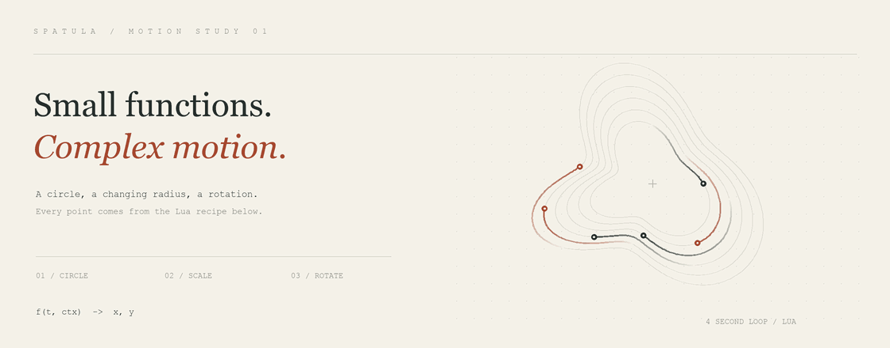

# Spatula

Compose movement and behavior from small Lua functions.

A curve maps time to a value: `f(t, ctx) → value`. Two curves make a motion.
Layer, scale, rotate, or retime those functions to build orbits, UI animation,
particle paths, procedural patterns, and reactive game behavior.

[](examples/orbit.lua)

<!-- orbit-example:start -->
```lua
local Spatula = require("spatula")
local C, M = Spatula.Curve, Spatula.Motion

local orbit = M.rotate(
    M.scale(M.circle(1, 0.25), C.offset(C.sin(0.75, 28), 100)),
    C.sin(0.25, 0.35)
)

return orbit
```
<!-- orbit-example:end -->

The animation samples this exact [Lua recipe](examples/orbit.lua). The renderer
adds trails and scaled, staggered copies; every position comes from `orbit(t, {})`.
[Still preview](docs/assets/orbit.png) · [Build the animation](docs/README.md) · [Motion sketchbook](sketchbook/README.md)

The Lua core has no external dependencies. LÖVE is optional for the demos and
editor. Lua 5.4, Lua 5.5, and LuaJIT are the CI targets.

## Try it

From a checkout, install with [LuaRocks](https://luarocks.org/):

```sh
luarocks --local make spatula-scm-1.rockspec
```

This installs the current checkout. The development rockspec is not yet published
to the LuaRocks registry. Make sure your Lua environment includes the installation
paths reported by `luarocks path`.

Or build a portable source bundle with Python 3:

```sh
python3 tools/package.py
```

Extract `dist/spatula-source.zip` into your project's module search directory
(usually its root). Keep `spatula.lua` beside the `spatula/` directory. Then
`require("spatula")` works without a package manager or runtime path shim.
The bundle contains the Lua core, the experimental compiler, and documentation;
it excludes demos, native binaries, editor code, browser experiments, and dependencies.

Start with the [quickstart](QUICKSTART.md). Every Lua example in this README,
the quickstart, and the [compiler guide](compiler/README.md) is executed against
a freshly extracted bundle by `python3 tools/check_examples.py`. Add
`--luarocks luarocks` to check a real LuaRocks installation instead.

## What's here

| Module | Purpose |
| --- | --- |
| `Curve` | Oscillation, easing, arithmetic, and time transforms |
| `Signal` / `S` | Values read from a context, such as an entity's radius |
| `Motion` | Two-dimensional paths composed from curves |
| `Field` | Spatial influence from sources and falloff curves |
| `Forms` | Geometric containment, boundaries, and set operations |
| `Distribution` | Point patterns inside forms |
| `Trigger` | Timing and selection applied to actions |
| `Point`, `Audio`, `Tempo`, `Util` | Geometry, audio-derived signals, musical timing, and math |

The Lua modules are the reference implementation. The compiler and pools,
native accelerators, LÖVE editor, and JavaScript port are experimental and do not
have identical API coverage. In particular, the JavaScript sketchbook is a
visual showcase, not a complete JavaScript release of the library.

For the browser showcase, run `python3 -m http.server 8765 --bind 127.0.0.1`
from the checkout and open `/sketchbook/`. See its [guide](sketchbook/README.md).

## Conventions

- Time and durations are in seconds; oscillator frequency is cycles per second.
  Oscillator phase and rotation angles are radians.
- Build compositions once, then sample them at elapsed time.
- Numeric primitive parameters are fixed when constructed. Use `Signal` with
  a combinator that accepts a curve for reactive values.
- `follow` and `spring` keep history in `ctx.curveState`. Reuse one context per
  entity and advance time monotonically; use a fresh context to reset.
- Core `Curve.sequence({segments})` repeats. Compiler `curve.sequence(...)`
  is finite. See the compiler guide before switching evaluation paths.

## Development

```sh
python3 tools/test.py --lua lua
python3 tools/test.py --lua luajit
python3 tools/check_examples.py --lua lua
python3 tools/check_examples.py --lua luajit
```

Tests run independently of checkout name or working directory. Timing comparisons
are opt-in with `--benchmarks`; performance depends on workload and runtime.
See [contributing](CONTRIBUTING.md) and the [composition philosophy](PHILOSOPHY.md).

## License

[MIT](LICENSE).
